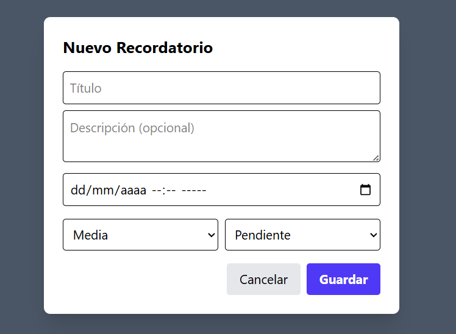
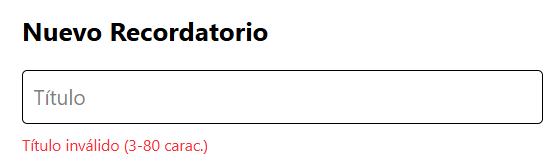
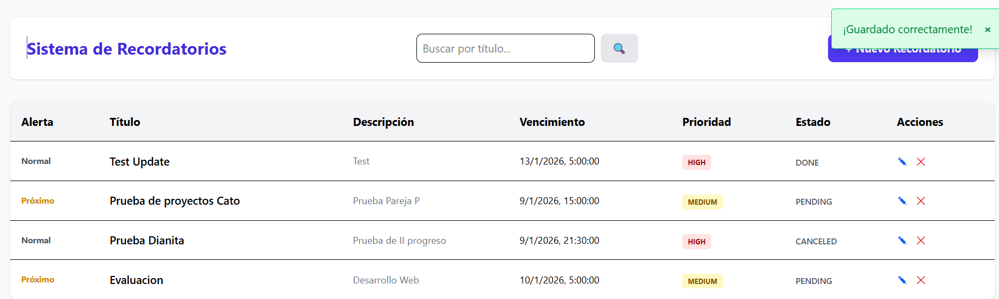

# Sistema de Gestión de Recordatorios (Frontend)

Este proyecto es una **Single Page Application (SPA)** desarrollada con **React** que permite la gestión integral de recordatorios consumiendo una API REST externa. El objetivo principal es aplicar principios de componentización, arquitectura modular y el uso de hooks avanzados.

---

## Instrucciones de Instalación

Sigue estos pasos para configurar el entorno de desarrollo en tu máquina local:

1. **Clonar el repositorio o crear el proyecto base:**
```bash
npm create vite@latest reminders-front -- --template react
cd reminders-front

```

2. **Instalar las dependencias de React:**
```bash
npm install

```
3. **Instalar y configurar Tailwind CSS (v4):**
```bash
npm install @tailwindcss/postcss tailwindcss postcss autoprefixer

```

4. **Asegurar la estructura de carpetas:**
Crea las carpetas necesarias dentro de `src/`:
* `src/components/`
* `src/services/`

---

## Instrucciones para Ejecutar

Para poner en marcha la aplicación, utiliza los siguientes comandos:

1. **Iniciar el servidor de desarrollo:**
```bash
npm run dev

```

2. **Acceder a la aplicación:**
Abre tu navegador en la dirección: `http://localhost:5173`

**Nota sobre el Backend:** Por defecto, la aplicación está configurada para conectarse a la API alojada en AWS: `http://ec2-3-236-168-225.compute-1.amazonaws.com/api/v1`.

---

## Descripción de la Arquitectura de Componentes

La aplicación sigue un flujo de datos unidireccional y una estructura modular para facilitar el mantenimiento.

### 1. Componente Principal: `App.jsx`

Es el **orquestador** de la aplicación. Sus responsabilidades incluyen:

* Gestionar el estado global de los recordatorios con `useState`.
* Cargar los datos desde el servidor al iniciar mediante `useEffect`.
* Implementar las operaciones CRUD y coordinar la comunicación entre componentes.
* Manejar la visibilidad del modal y el sistema de alertas.

### 2. Componente: `ReminderForm.jsx`

Componente especializado en la captura de datos.

* Funciona como un **componente controlado** para los campos de Título, Descripción, Fecha, Prioridad y Estado.
* Implementa validaciones client-side (título entre 3 y 80 caracteres).
* Incluye contadores de caracteres y manejo de errores en tiempo real.

### 3. Componente: `Alert.jsx`

Se encarga de dar retroalimentación visual al usuario.

* Presenta colores dinámicos según el tipo: `success`, `error`, `warning` o `info`.
* Se oculta automáticamente tras 5 segundos.

### 4. Componente: `LoadingSpinner.jsx`

Indicador visual de carga que mejora la **experiencia de usuario (UX)** durante las peticiones asíncronas al servidor.

### 5. Servicio: `api.js`

Capa de abstracción que centraliza todas las peticiones `fetch` utilizando el patrón de servicio. Esto desacopla la lógica de red de la lógica visual de React.





---
